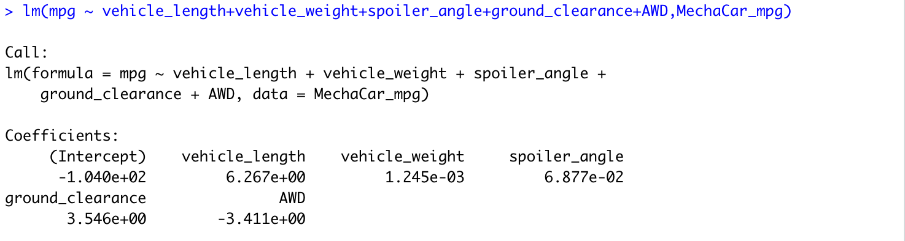
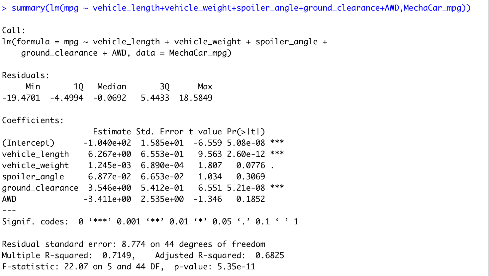

# Deliverable 1: Linear Regression to Predict MPG

MechaCar_mpg.csv file contains a data of 50 vehicles.  The table headers are vehicle_length, vehicle_weight, spoiler_angle, ground_angle, ground_clearance, AWD and mpg.   

1. Use the library() function to load the dplyr package.

> install.packages("dplyr")
>library(dplyr)

2. Perform linear regression using the lm() function. 

Please see a result below:

3. Using the summary() function, determine the p-value and the r-squared value for the linear regression model.

Please see a summary of each column of MechaCar_mpg.csv file below:

## Linear Regression to Predict MPG

- As a result, there is no variables/coefficients that had provided a non-random amount of variance to the mpg values in the dataset. The null hypothesis can be rejected, because Pr(>|t|) is grater than 0.05

- The slope of the linear model is not considered to be zero. The mpg values corresponding the data variables/coefficients.

- This linear model predict mpg of MechaCar prototypes effectively, because the Multiple R-squared mean is 0.7149.

# Deliverable 2: Summary Statistics on Suspension Coils. Create Visualizations for the Trip Analysis.

1. The suspension coil’s PSI continuous variable across all manufacturing lots.

Here is a table with mean, median, variance and sd of Suspension Coils.csv data:

2. The following PSI metrics for each lot: mean, median, variance, and standard deviation.

Please see below a summary with 3 manufacturing lots. 

## Summary Statistics on Suspension Coils

The design specifications for the MechaCar suspension coils dictate that the variance of the suspension coils must not exceed 100 pounds per square inch. The current manufacturing data meet this design specification for all manufacturing lots in total, because PSI lower than 100. However, lot 3 does not meet it individually with PSI higher 100. 

# Deliverable 3: T-Test on Suspension Coils

## T-Tests on Suspension Coils

# Deliverable 4: Design a Study Comparing the MechaCar to the Competition

## Study Design: MechaCar vs Competition

Write a short description of a statistical study that can quantify how the MechaCar performs against the competition. In your study design, think critically about what metrics would be of interest to a consumer: for a few examples, cost, city or highway fuel efficiency, horse power, maintenance cost, or safety rating.
In your description, address the following questions:
What metric or metrics are you going to test? Cost, type of car, compare all cars on 

What is the null hypothesis or alternative hypothesis? One car works another does not have it 

What statistical test would you use to test the hypothesis? And why?  Mean , compare the means 
Avo test to use

What data is needed to run the statistical test? I need if for different companies 

